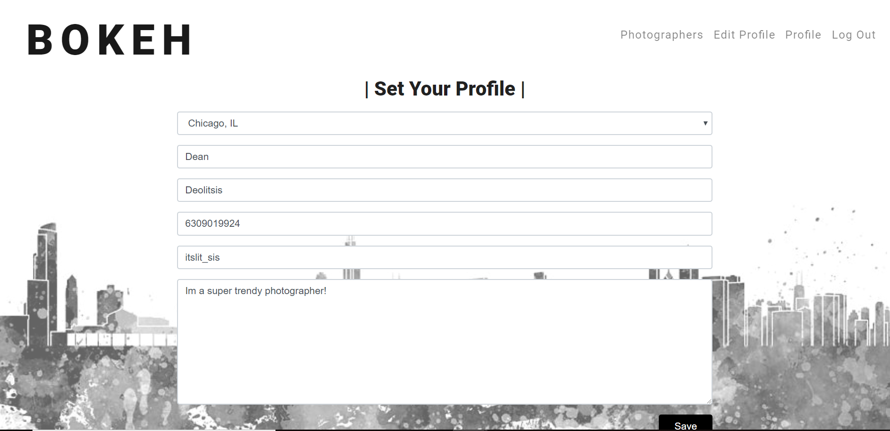
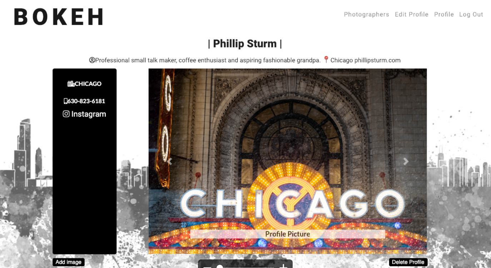

# Bokeh

## Bokeh is an interface where clients can interact with Photographers quickly and easily.

### Clients and Photographers both can easily communicate with each other by entering in basic information such as location and specific photography needs and interests.

## Instructions

## Live link

https://stark-inlet-23885.herokuapp.com/

### Landing Page

The landing page includes 2 options which both use Google Log in:
  1. Log in as a client
  2. Log in as a photographer
  
 
  
 #### Create your profile 
  
  Whether you sign in as a client or a photographer, you will be prompted to create your user profile which includes:
  
  ##### Required 
  
  First and Last name, phone number, and location
  ##### Optional
  
  Instagram profile link and bio
  
  
  

  When you hit save it will take you to your User Profile

  

  
  ### Search Page
  
  You can search by location or photography keyword interests to load photographers that you can reach out to

  
  
  
  
  ### Team Members
  
  - Dean Deolitsis [DeanDeo](https://github.com/DeanDeo)
  - Patrick Holmes [Pholmes10](https://github.com/pholmes10)
  - Nathan Walker  [Nathanw88](https://github.com/nathanw88)
  - May Zhou       [maydeyn](https://github.com/maydeyn)
  - Phillip Sturm  [PhillipSturm](https://github.com/PhillipSturm)
  
  
  
  
  
  
  
  
  

